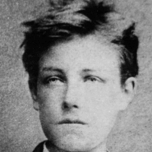

# Arthur Rimbaud - O Poeta como Vidente

## Biografia

!!! note inline end "Aviso"
    Este é apenas um resumo da biografia de Rimbaud. [utilize esse quadro para notas]

 Arthur Rimbaud (1854-1891) foi um poeta francês cuja breve, porém intensa, carreira literária o destacou como um dos mais influentes do século XIX. Sua notável precocidade artística o levou a escrever obras poéticas profundamente provocativas, como "Uma Temporada no Inferno", desafiando as normas literárias de sua época. Rimbaud teve um relacionamento tumultuado com o poeta Paul Verlaine, influenciando profundamente sua obra. Abandonou a poesia precocemente aos 21 anos, embarcou em aventuras pelo mundo e voltou à França, onde sua saúde deteriorou-se rapidamente até sua morte precoce aos 37 anos. Rimbaud deixou um legado duradouro na literatura, sendo considerado precursor do simbolismo e surrealismo, explorando temas de busca espiritual e rebelião contra a sociedade convencional.

!!! warning "Rimbaud e Hollywood"
    Alguns filmes de Hollywood usam a imagem de Rimbaud e contam histórias falsas sobre a vida do poeta. Tome cuidado!. [utlize esse quadro para avisos]


## Paris nos anos 1875

Na Paris de 1875, a vida era marcada por uma atmosfera vibrante e efervescente que encapsulava os diversos aspectos culturais, sociais e políticos da época. A cidade estava no auge da _Belle Époque_ (1) , um período de relativa paz e prosperidade após a turbulência da Guerra Franco-Prussiana e da Comuna de Paris. As ruas parisienses eram cenário de elegantes boulevards, cafés lotados, salões literários e artísticos, além de suntuosos teatros e óperas. A cidade era um centro de criatividade artística e literária, atraindo escritores, pintores, músicos e intelectuais de todo o mundo. Enquanto as classes abastadas desfrutavam da alta cultura e do luxo, a classe trabalhadora enfrentava desafios socioeconômicos, levando a movimentos de trabalhadores e reformas. Paris, nesse período, continuava a ser uma fonte de inspiração e inovação em todas as áreas da vida, moldando a cultura europeia e global.
{ .annotate }

1.  :man_raising_hand: **A Belle Époque foi um período de relativa paz e prosperidade na virada do século XIX para o XX, caracterizado por uma efervescente criatividade artística e cultural, luxo e avanços tecnológicos na Europa.**

## Trecho de poemas

=== "O Barco Bêbado"

    ```
        Sim, chorar eu chorei! São mornas as Auroras! 
        Toda lua é cruel e todo sol, engano: 
        O amargo amor opiou de ócios minhas horas. 
        Ah! que esta quilha rompa! Ah! que me engula o oceano! 

        Da Europa a água que eu quero é só o charco 
        Negro e gelado onde, ao crepúsculo violeta, 
        Um menino tristonho arremesse o seu barco 
        trêmulo como a asa de uma borboleta. 

        No meu torpor, não posso, ó vagas, as esteiras
        Ultrapassar das naves cheias de algodões,
        Nem vencer a altivez das velas e bandeiras,
        Nem navegar sob o olho torvo dos pontões . 
        

        (Tradução de Augusto de Campos)

    ```
=== "Le bateau ivre"

    ```
        Mais, vrai, j’ai trop pleuré ! Les Aubes sont navrantes. 
        Toute lune est atroce et tout soleil amer :
        L’âcre amour m’a gonflé de torpeurs enivrantes. 
        Ô que ma quille éclate ! Ô que j’aille à la mer ! 

        Si je désire une eau d’Europe, c’est la flache 
        Noire et froide où vers le crépuscule embaumé 
        Un enfant accroupi plein de tristesse, lâche 
        Un bateau frêle comme un papillon de mai. 

        Je ne puis plus, baigné de vos langueurs, ô lames, 
        Enlever leur sillage aux porteurs de cotons, 
        Ni traverser l’orgueil des drapeaux et des flammes,
        Ni nager sous les yeux horribles des pontons. !
    ```   

## O que mais da pra fazer? 

Qualquer texto pode ser {--deletado--} e no lugar dele você pode adicionar {++alguma coisa++}.
E também é possível acrescentar {>>destaque a frases<<}.

{==

Também é possível colocar textos em caixas como essa, para maior destaque ainda!

==}

## Texto com imagem 

{ align=left }
Arthur Rimbaud, nascido em 20 de outubro de 1854, em Charleville, França, é amplamente reconhecido como um dos poetas mais influentes e provocativos do século XIX. Sua vida foi marcada por uma notável precocidade e um talento literário extraordinário que o fez se destacar desde tenra idade. Rimbaud iniciou sua jornada poética aos 16 anos, quando escreveu sua obra-prima, "Uma Temporada no Inferno" (1873), que desafiou as convenções literárias de sua época.

Sua busca por uma expressão artística mais radical e sua rebeldia contra as normas sociais e culturais o levaram a um relacionamento conturbado com o poeta simbolista Paul Verlaine. Os dois tiveram um relacionamento tumultuado e autodestrutivo que influenciou profundamente a obra de Rimbaud.

Rimbaud também é conhecido por sua contribuição à poesia simbolista e surrealista, sendo um precursor desses movimentos. Seus poemas, como "O Barco Bêbado", exploram temas como a busca espiritual, a natureza da realidade e a fuga da sociedade convencional.

... .... ....

***


??? info "Questão: Você conhece algum poeta contemporâneo de Rimbaud?"
    Alguns são: Paul Verlaine (1844-1896), Stéphane Mallarmé (1842-1898), Paul Valéry (1871-1945), Rainer Maria Rilke (1875-1926), entre outros.

??? info "Questão 2: [ escreva aqui a questão] ?"
    Aqui vem a resposta, com Lorem ipsum dolor sit amet, consectetur adipiscing elit, sed do eiusmod tempor incididunt ut labore et dolore magna aliqua
